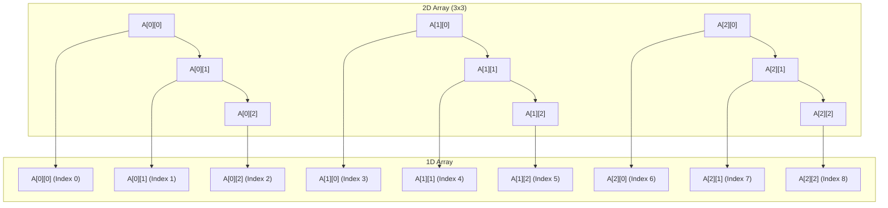
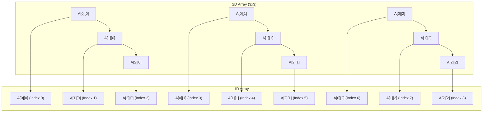

Arrays are vector variables. 

### Declaration 

```
int A[5];

The values will be grabage values in this type of declaration. 

//All values initialized
int A[5] = {1,2,3,4,5,6};

//Some values areinitialized 
int A[5] = {1,2}; A = 1,2,0,0,0

int A[5] = {0}; A= 0,0,0,0,0

int A[] = {1,2,3,4,5} Array of size 5 is created. 


```

### Accessing 

```
//Subscript

A[i]


//Pointer

*(A+1), *A
```


### Static vs Dynamic Array

```
//This will be created in stack 
//The size of the array is decided at compile time in this case
//
int A[5];

//Size of the array is decided at runtime. 
int n ; 
cin >> n >> endl;
int B[n]

//This creates memory in stack for p . 
int *p;
//This creates memory in heap 
p = new int[5];

//relesing the memory
delete []p;


//Increasing the size of the array 


int *q = new int[10];
for(i=0; i < 5; i++)
q[i] = p[i];

delete []p;

p=q;

q= null;

//The reason why arrays size cannot be grown directly is becuase the memory locations should be contiguous


```


### 2D arrays

```
3 methods of creating them 

  // 2D array
  // Inside stack
  int A[3][4] = {{1, 2, 3, 4}, {1, 2, 3, 4}, {1, 2, 3, 4}};

  // Inside Stack &  Heap
  int *B[3];
  B[0] = new int[4];
  B[1] = new int[4];
  B[2] = new int[4];

  // Inside heap
  int **C;
  C = new int *[3];
  C[0] = new int[4];
  C[1] = new int[4];
  C[2] = new int[4];

  // Traversing the 2D Array
  for (int i = 0; i < 3; i++) {
    for (int j = 0; j < 4; j++) {
      cout << A[i][j] << " ";
    }
    cout << endl;
  }

  // Initializing the stack and heap 2D arrays
  for (int i = 0; i < 3; i++) {
    for (int j = 0; j < 4; j++) {
      B[i][j] = i + j;
    }
  }

  for (int i = 0; i < 3; i++) {
    for (int j = 0; j < 4; j++) {
      cout << B[i][j] << " ";
    }
    cout << endl;
  }

```


### Row Major & Column major mappings

There are two ways of mapping 2D arrays to single dimensional arrays by the compiler as the arrays are all single dimensional . 

In Row major mapping element are stored row by row. 

Add(A[ij]) = L0 + (i * n  + j) *w





In column major mapping elements are stored column by column. 

Address of element i j = L0 + [j*m + i] * w




C/C++ follows row major formula. 

### Formula for nD arrays


## ADT


#### Data
1. Array Space
2. Size
3. Length

#### Operations

1. Display
2. Add/Append'
3. Insert
4. Delete
5. Search
6. Get
7. Set
8. Max
9. Min
10. reverse
11. Shift/Rotate

```

```

#### Array rotation and shifting

Best Approach for Different Cases

    Small k? Use the Basic Shift method.
    Large k? Use the Reverse Method.
    Want an optimized method? Use Juggling Algorithm.
    Binary array? Use Bitwise Operations.

#### Element locations after rotation

1. Formula for Left Rotation

If an element is originally at index i, after k left rotations, its new index will be:
newIndex=(i−k+n)mod  n
newIndex=(i−k+n)modn
Explanation

    (i - k): Moves k steps left.
    + n: Ensures the index remains positive if i - k is negative.
    % n: Wraps around when reaching the start of the array.

Example
```
#include <iostream>
using namespace std;

int getNewIndexLeft(int i, int n, int k) {
    return (i - k + n) % n;
}

int main() {
    int n = 7;  // Array size
    int i = 3;  // Original index
    int k = 2;  // Rotate left by 2

    int newIndex = getNewIndexLeft(i, n, k);
    cout << "New index after left rotation: " << newIndex << endl;  // Output: 1

    return 0;
}
```


✔️ Time Complexity: O(1)
✔️ Space Complexity: O(1)
2. Formula for Right Rotation

If an element is originally at index i, after k right rotations, its new index will be:
newIndex=(i+k)mod  n
newIndex=(i+k)modn
Explanation

    (i + k): Moves k steps right.
    % n: Wraps around when reaching the end of the array.

Example
```
`#include <iostream>`
`using namespace std;`

`int getNewIndexRight(int i, int n, int k) {`
    `return (i + k) % n;`
`}`

`int main() {`
    `int n = 7;  // Array size`
    `int i = 3;  // Original index`
    `int k = 2;  // Rotate right by 2`

    `int newIndex = getNewIndexRight(i, n, k);`
    `cout << "New index after right rotation: " << newIndex << endl;  // Output: 5`

    `return 0;`
`}`

```

✔️ Time Complexity: O(1)
✔️ Space Complexity: O(1)
1. Finding the New Element at a Position After k Rotations

If you want to find which element will be at index j after k rotations, instead of finding the index of an element, you can reverse the logic.

    For Left Rotation: The element that originally was at index (j + k) % n will now be at j.
    For Right Rotation: The element that originally was at index (j - k + n) % n will now be at j.
1.
```
int getElementAfterLeftRotation(int arr[], int n, int j, int k) {
    return arr[(j + k) % n];  // Get the element that moves into position j
}

int getElementAfterRightRotation(int arr[], int n, int j, int k) {
    return arr[(j - k + n) % n];  // Get the element that moves into position j
}
```


2. When to Use This Formula?

    When you only need the position of an element after rotation instead of modifying the array.
    When k is very large (e.g., k = 10^9 for large arrays), as it avoids unnecessary computation.
    For competitive programming, where efficiency matters.