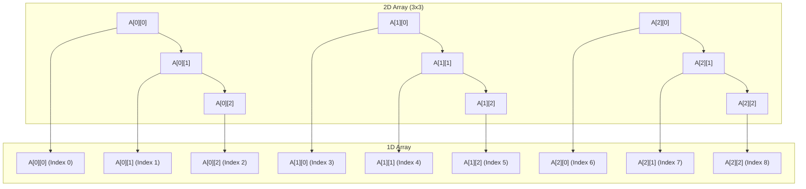
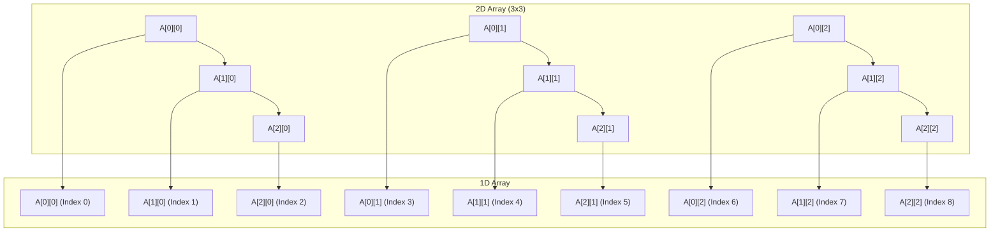

Arrays are vector variables. 

### Declaration 

```
int A[5];

The values will be grabage values in this type of declaration. 

//All values initialized
int A[5] = {1,2,3,4,5,6};

//Some values areinitialized 
int A[5] = {1,2}; A = 1,2,0,0,0

int A[5] = {0}; A= 0,0,0,0,0

int A[] = {1,2,3,4,5} Array of size 5 is created. 


```

### Accessing 

```
//Subscript

A[i]


//Pointer

*(A+1), *A
```


### Static vs Dynamic Array

```
//This will be created in stack 
//The size of the array is decided at compile time in this case
//
int A[5];

//Size of the array is decided at runtime. 
int n ; 
cin >> n >> endl;
int B[n]

//This creates memory in stack for p . 
int *p;
//This creates memory in heap 
p = new int[5];

//relesing the memory
delete []p;


//Increasing the size of the array 


int *q = new int[10];
for(i=0; i < 5; i++)
q[i] = p[i];

delete []p;

p=q;

q= null;

//The reason why arrays size cannot be grown directly is becuase the memory locations should be contiguous


```


### 2D arrays

```
3 methods of creating them 

  // 2D array
  // Inside stack
  int A[3][4] = {{1, 2, 3, 4}, {1, 2, 3, 4}, {1, 2, 3, 4}};

  // Inside Stack &  Heap
  int *B[3];
  B[0] = new int[4];
  B[1] = new int[4];
  B[2] = new int[4];

  // Inside heap
  int **C;
  C = new int *[3];
  C[0] = new int[4];
  C[1] = new int[4];
  C[2] = new int[4];

  // Traversing the 2D Array
  for (int i = 0; i < 3; i++) {
    for (int j = 0; j < 4; j++) {
      cout << A[i][j] << " ";
    }
    cout << endl;
  }

  // Initializing the stack and heap 2D arrays
  for (int i = 0; i < 3; i++) {
    for (int j = 0; j < 4; j++) {
      B[i][j] = i + j;
    }
  }

  for (int i = 0; i < 3; i++) {
    for (int j = 0; j < 4; j++) {
      cout << B[i][j] << " ";
    }
    cout << endl;
  }

```


### Row Major & Column major mappings

There are two ways of mapping 2D arrays to single dimensional arrays by the compiler as the arrays are all single dimensional . 

In Row major mapping element are stored row by row. 

Add(A[ij]) = L0 + (i * n  + j) *w





In column major mapping elements are stored column by column. 

Address of element i j = L0 + [j*m + i] * w




C/C++ follows row major formula. 

### Formula for nD arrays


## ADT


