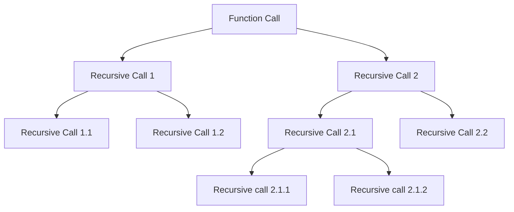

## Generalizing Recursion

```
void fun(n){
if(n > 0){
// ---> this is ascending phase
fun(n-1);
}
// ---> this is descending phase
}
```

## How Recursion uses Stack 

Each recursive function call creates a activation record on the stack. 

The Space Complexity is O(n) where n is the number of recursive calls. 

```
#include <iostream>

using namespace std;

void fun2(int n) {
  if (n > 0) {
    cout << n << endl;
    fun2(n - 1);
  }
}
int main() {
  int x = 3;
  fun2(x);

  return 0;
}
```


### Time complexity of Recursive Function

#### Recurrence Relation

```
void fun1(int n){ -- < T(n)
if(n>0){  --- > 1
cout << n << endl; ---> 1
fun1(n-1); --- > T(n-1)
}
}


Lets the assume the time taken by total function call be T(n);

T(n) = Tn(n-1) + 2 when n > 0
T(n) = 0 when n = 0


Induction method
 ? ? Learn ? ? 


```


### Static Variables in Recursion 

Static variables is not created every time a function is called it will only be created once at the loading time of the program . 

When drawing the recursion tree , just create a single copy of the static variable. 

In essence, the static variable behaves as a global variable. 


```
int fun(int n) {

  static int x = 0;

  if (n > 0) {

    x++;
    return fun(n - 1) + x;
  }
  return 0;
}

```

### Types of Recursion 

#### Tail Recursion 

If the recursive call is the last statement in the function , then it is called tail recursion. 

No operation is performed at returning time. 

```
void tailRecursion(int n) {
  if (n > 0) {
    cout << n << endl;
    tailRecursion(n - 1);
  }
};

```

#### Comparison of Tail recursion with loop

```
void tailRecusrion(int n){
while(n > 0){
cout << n << endl;
n--;
}
}
```

Tail Recursion can be easily converted into a loop. 
Time Complexity is same , but space complexity is higher in recursion . 

#### Head Recursion 

The first statement inside the function is the recursive call. 

All the operations are done after the recursive call . 

```
void headRecursion(int n) {
  if (n > 0) {
    headRecursion(n - 1);
    cout << n << endl;
  }
};

```


#### Linear Recursion

Functions which do processing before and after the recursive call but there is only one recursive call . 

```
void linearRecursion(int n) {
  if (n > 0) {
    cout << n << endl;
    linearRecursion(n - 1);
    cout << n << endl;
  }
};

```


#### Tree Recursion

If a recursive function is calling itself more than one time its a tree recursion . 

```
void treeRecursion(int n) {
  if (n > 0) {
    treeRecursion(n - 1);

    cout << n << endl;

    treeRecursion(n - 1);
  }
}

```

![[Pasted image 20250121061728.png]]

Number of calls made at each level  = 1 + 2 + 4 + 8 = 15

Which is equal to 

$$
2^0 + 2^1 + 2^2 + 2^3 = 15
$$
Sum of GP series  =  $$ 2^(n_+1) -1 $$

Time complexity = O (2^n);

Space Complexity = O (n);


#### Indirect Recursion

There are two or more functions which are calling each other in a circular order. 


```

```

![[Pasted image 20250121063644.png]]


#### Nested Recursion

![[Pasted image 20250121065525.png]]

#### Sum of N natural numbers
```
int sum(int n) {
  if (n == 0) {
    return 0;
  } else {
    return sum(n - 1) + n;
  }
}

```

Formula : $$ (n*(n+1))/2 $$
$$ T(n) = O(n) $$
$$ S(n) = O(n) $$

#### Factorial of a number

```
int factorial(int n) {
  if (n == 0) {
    return 1;
  } else {
    return factorial(n - 1) * n;
  }
}

```


#### Exponents using recursion 

```
// Exponent using recursion
long int exponent(long int base, int power) {
  if (power == 0)
    return 1;
  else
    return base * exponent(base, power - 1);
}

//Optimization
long int exponentOptimized(long int base, int power) {
  if (power == 0)
    return 1;
  if (power % 2 == 0) {
    return exponent(base * base, power / 2);
  } else {
    return base * exponent(base * base, power / 2);
  }
}


//driver
  auto start1 = chrono::high_resolution_clock::now();
  cout << "Exponent" << endl;
  cout << exponent(1000, 1000) << endl;
  auto end1 = chrono::high_resolution_clock::now();

  auto start2 = chrono::high_resolution_clock::now();
  cout << "Optimized Exponent" << endl;
  cout << exponentOptimized(1000, 1000) << endl;
  auto end2 = chrono::high_resolution_clock::now();

  auto duration1 = chrono::duration_cast<chrono::microseconds>(end1 - start1);
  auto duration2 = chrono::duration_cast<chrono::microseconds>(end2 - start2);

  cout << "Duration 1 : " << duration1.count() << endl;
  cout << "Duration 2 : " << duration2.count() << endl;

```


#### Taylor Series $$e^x$$
