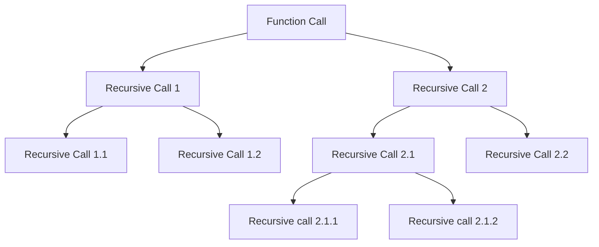

## Generalizing Recursion

```
void fun(n){
if(n > 0){
// ---> this is ascending phase
fun(n-1);
}
// ---> this is descending phase
}
```

## How Recursion uses Stack 

Each recursive function call creates a activation record on the stack. 

The Space Complexity is O(n) where n is the number of recursive calls. 

```
#include <iostream>

using namespace std;

void fun2(int n) {
  if (n > 0) {
    cout << n << endl;
    fun2(n - 1);
  }
}
int main() {
  int x = 3;
  fun2(x);

  return 0;
}
```


### Time complexity of Recursive Function

#### Recurrence Relation

```
void fun1(int n){ -- < T(n)
if(n>0){  --- > 1
cout << n << endl; ---> 1
fun1(n-1); --- > T(n-1)
}
}


Lets the assume the time taken by total function call be T(n);

T(n) = Tn(n-1) + 2 when n > 0
T(n) = 0 when n = 0


Induction method
 ? ? Learn ? ? 


```


### Static Variables in Recursion 

Static variables is not created every time a function is called it will only be created once at the loading time of the program . 

When drawing the recursion tree , just create a single copy of the static variable. 

In essence, the static variable behaves as a global variable. 


```
int fun(int n) {

  static int x = 0;

  if (n > 0) {

    x++;
    return fun(n - 1) + x;
  }
  return 0;
}

```

### Types of Recursion 

#### Tail Recursion 

If the recursive call is the last statement in the function , then it is called tail recursion. 

No operation is performed at returning time. 

```
void tailRecursion(int n) {
  if (n > 0) {
    cout << n << endl;
    tailRecursion(n - 1);
  }
};

```

#### Comparison of Tail recursion with loop

```
void tailRecusrion(int n){
while(n > 0){
cout << n << endl;
n--;
}
}
```

Tail Recursion can be easily converted into a loop. 
Time Complexity is same , but space complexity is higher in recursion . 

#### Head Recursion 

The first statement inside the function is the recursive call. 

All the operations are done after the recursive call . 

```
void headRecursion(int n) {
  if (n > 0) {
    headRecursion(n - 1);
    cout << n << endl;
  }
};

```


#### Linear Recursion

Functions which do processing before and after the recursive call but there is only one recursive call . 

```
void linearRecursion(int n) {
  if (n > 0) {
    cout << n << endl;
    linearRecursion(n - 1);
    cout << n << endl;
  }
};

```


#### Tree Recursion

If a recursive function is calling itself more than one time its a tree recursion . 

```
void treeRecursion(int n) {
  if (n > 0) {
    treeRecursion(n - 1);

    cout << n << endl;

    treeRecursion(n - 1);
  }
}

```

![[Pasted image 20250121061728.png]]

Number of calls made at each level  = 1 + 2 + 4 + 8 = 15

Which is equal to 

$$
2^0 + 2^1 + 2^2 + 2^3 = 15
$$
Sum of GP series  =  $$ 2^(n_+1) -1 $$

Time complexity = O (2^n);

Space Complexity = O (n);


#### Indirect Recursion

There are two or more functions which are calling each other in a circular order. 


```

```

![[Pasted image 20250121063644.png]]


#### Nested Recursion

![[Pasted image 20250121065525.png]]

#### Sum of N natural numbers
```
int sum(int n) {
  if (n == 0) {
    return 0;
  } else {
    return sum(n - 1) + n;
  }
}

```

Formula : $$ (n*(n+1))/2 $$
$$ T(n) = O(n) $$
$$ S(n) = O(n) $$

#### Factorial of a number

```
int factorial(int n) {
  if (n == 0) {
    return 1;
  } else {
    return factorial(n - 1) * n;
  }
}

```


#### Exponents using recursion 

```
// Exponent using recursion
long int exponent(long int base, int power) {
  if (power == 0)
    return 1;
  else
    return base * exponent(base, power - 1);
}

//Optimization
long int exponentOptimized(long int base, int power) {
  if (power == 0)
    return 1;
  if (power % 2 == 0) {
    return exponent(base * base, power / 2);
  } else {
    return base * exponent(base * base, power / 2);
  }
}


//driver
  auto start1 = chrono::high_resolution_clock::now();
  cout << "Exponent" << endl;
  cout << exponent(1000, 1000) << endl;
  auto end1 = chrono::high_resolution_clock::now();

  auto start2 = chrono::high_resolution_clock::now();
  cout << "Optimized Exponent" << endl;
  cout << exponentOptimized(1000, 1000) << endl;
  auto end2 = chrono::high_resolution_clock::now();

  auto duration1 = chrono::duration_cast<chrono::microseconds>(end1 - start1);
  auto duration2 = chrono::duration_cast<chrono::microseconds>(end2 - start2);

  cout << "Duration 1 : " << duration1.count() << endl;
  cout << "Duration 2 : " << duration2.count() << endl;

```


#### Taylor Series $$e^x = 1 + x/1 + x^2/2! + x^3/3! + ...... + n terms
$$

```
Without static variable

long double taylorSeries(int base, long int n) {
  if (n == 0) {
    return 1;
  } else {
    return taylorSeries(base, n - 1) +
           exponentOptimized(base, n) / factorial(n);
  }
}

With static variable
long double staticTaylorRecursive(int base, int n) {
  static double numerator = 1, denominator = 1;
  double r;
  if (n == 0) {
    return 1;
  } else {
    r = staticTaylorRecursive(base, n - 1);
    numerator *= base;
    denominator *= n;
    return r + (numerator / denominator);
  }
}


With Horner's rule
// taylor series with Horner's rule
long double hornerTalyorIterative(int base, int n) {
  double s = 1;
  for (; n > 0; n--) {
    s = 1 + base / (n * s);
  }
  return s;
}

//recursive taylor series with Horner
long double hornerTaylorRecursive(int base, int n) {
  static double s = 1;
  if (n == 0) {
    return s;
  }
  s = 1 + base / (n * s);
  return hornerTaylorRecursive(base, n - 1);
}


```

##### Taylor series and static variables in recursion 


Actual addition starts at returning time, same for factorial and the power. 


**_ WHEN YOU HAVE RETURN MULTIPLE VALUES IN A RECURSIVE FUNCTION THEN WE CAN USE STATIC VARIABLES _**


##### Horner's Rule

$$
e^x = 1 + x/1 + x^2/2! + x^3/3! + .....+ n 
$$

$$
e^x = 1+ x/1[1 + x/2[1 + x/3[1+ x/n]]]
$$

#### Fibonacci series

Definition

$$ 
fib(n) = 
\begin{cases}
0 & \text{if } n = 0, \\
1 & \text{if } n = 1, \\
fib(n-1) + fib(n-1) & \text{if } n > 1.
\end{cases}
$$

```
long int fib(int n) {
  if (n <= 1)
    return n;
  return fib(n - 1) + fib(n - 2);
}
T(n) = O(2^n)


long int fibIterative(int n) {
  int t0 = 0, t1 = 1;
  int tn = 0;
  if (n == 0 || n == 1)
    return n;
  for (int i = 2; i <= n; i++) {
    tn = t0 + t1;
    t0 = t1;
    t1 = tn;
  }
  return tn;
}
```

##### Memoization

```
int F[10];
long int fibRecursiveMemoized(int n) {
  if (n <= 1) {
    F[n] = n;
    return n;
  } else {
    if (F[n - 2] == -1) {
      F[n - 2] = fibRecursiveMemoized(n - 2);
    }
    if (F[n - 1] == -1) {
      F[n - 1] = fibRecursiveMemoized(n - 1);
    }
    return F[n - 2] + F[n - 1];
  }
};

```


#### Recursive $$ ^nCr $$
```
```

##### Pascal's triangle


##### How Pascal's Triangle Relates to \( nCr \):

The \( n \)-th row of Pascal's Triangle represents all the combinations \( nC0, nC1, \dots, nCn \).

### Examples:
- **Row 0**:  
  \( 1 \) (\( 0C0 \))  
- **Row 1**:  
  \( 1, 1 \) (\( 1C0, 1C1 \))  
- **Row 2**:  
  \( 1, 2, 1 \) (\( 2C0, 2C1, 2C2 \))  
- **Row 3**:  
  \( 1, 3, 3, 1 \) (\( 3C0, 3C1, 3C2, 3C3 \))  
- **Row 4**:  
  \( 1, 4, 6, 4, 1 \) (\( 4C0, 4C1, 4C2, 4C3, 4C4 \))


##### Pascal's Triangle and Binomial Coefficients

Below is Pascal's Triangle, where each entry corresponds to \( nCr = \frac{n!}{r!(n-r)!} \).

                           1
                        1     1
                     1     2     1
                  1     3     3     1
               1     4     6     4     1
               1, =101**20th


```
int combination(int n, int r) {
  if (r == 0 || n == r) {
    return 1;
  } else {
    return combination(n - 1, r - 1) + combination(n - 1, r);
  }
}

```