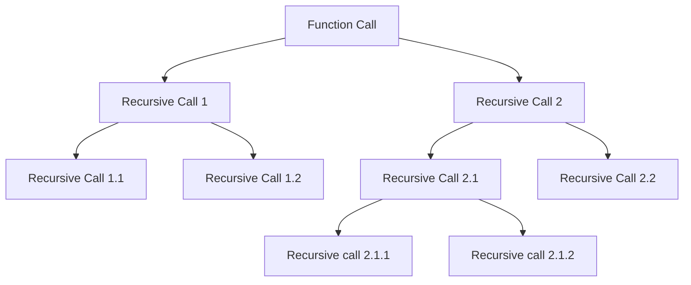

## Generalizing Recursion

```
void fun(n){
if(n > 0){
// ---> this is ascending phase
fun(n-1);
}
// ---> this is descending phase
}
```

## How Recursion uses Stack 

Each recursive function call creates a activation record on the stack. 

The Space Complexity is O(n) where n is the number of recursive calls. 

```
#include <iostream>

using namespace std;

void fun2(int n) {
  if (n > 0) {
    cout << n << endl;
    fun2(n - 1);
  }
}
int main() {
  int x = 3;
  fun2(x);

  return 0;
}
```


### Time complexity of Recursive Function

#### Recurrence Relation

```
void fun1(int n){ -- < T(n)
if(n>0){  --- > 1
cout << n << endl; ---> 1
fun1(n-1); --- > T(n-1)
}
}


Lets the assume the time taken by total function call be T(n);

T(n) = Tn(n-1) + 2 when n > 0
T(n) = 0 when n = 0


Induction method
 ? ? Learn ? ? 


```


### Static Variables in Recursion 

Static variables is not created every time a function is called it will only be created once at the loading time of the program . 

When drawing the recursion tree , just create a single copy of the static variable. 

In essence, the static variable behaves as a global variable. 


```
int fun(int n) {

  static int x = 0;

  if (n > 0) {

    x++;
    return fun(n - 1) + x;
  }
  return 0;
}

```

### Types of Recursion 

#### Tail Recursion 

If the recursive call is the last statement in the function , then it is called tail recursion. 

No operation is performed at returning time. 

```
void tailRecursion(int n) {
  if (n > 0) {
    cout << n << endl;
    tailRecursion(n - 1);
  }
};

```

#### Comparison of Tail recursion with loop

```
void tailRecusrion(int n){
while(n > 0){
cout << n << endl;
n--;
}
}
```

Tail Recursion can be easily converted into a loop. 
Time Complexity is same , but space complexity is higher in recursion . 

#### Head Recursion 

The first statement inside the function is the recursive call. 

All the operations are done after the recursive call . 

```
void headRecursion(int n) {
  if (n > 0) {
    headRecursion(n - 1);
    cout << n << endl;
  }
};

```


#### Tree Recursion

